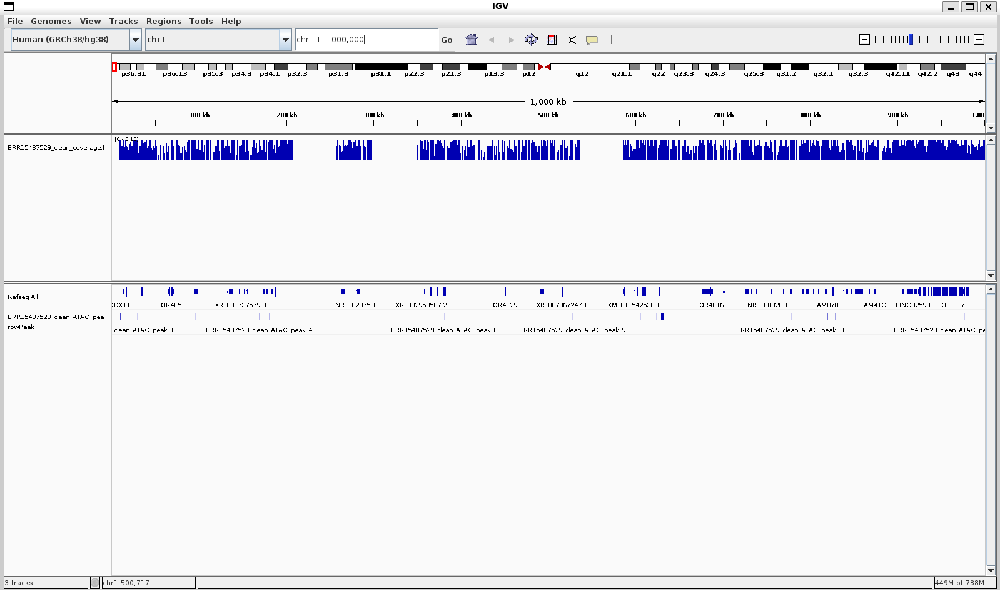

# ATAC-seq Nextflow Pipeline

A reproducible Nextflow workflow for paired-end ATAC-seq analysis, converted from an original Bash implementation and applied to real sequencing data.

The pipeline processes paired-end ATAC-seq reads from **ERR15487529** against the **hg38** reference genome and performs quality control, adapter trimming, alignment, BAM filtering, peak calling, coverage-track generation, and MultiQC reporting.

## Pipeline Overview

```text
Paired-end FASTQ
       │
       ▼
    FastQC
       │
       ▼
  Trim Galore
       │
       ▼
   Bowtie2
       │
       ▼
 SAMtools Filtering
       │
       ▼
     MACS2
   Peak Calling
       │
       ├──────────────► Peak files
       │
       ▼
   DeepTools
   bamCoverage
       │
       ▼
    BigWig
       │
       ▼
    MultiQC
```

## Project Highlights

- Converted a Bash-based ATAC-seq workflow into a modular Nextflow workflow for improved workflow organization and reproducibility.
- Automated seven major analysis stages from raw paired-end FASTQ data through peak calling, coverage-track generation, and quality reporting.
- Applied the workflow to ENA accession `ERR15487529` using the human `hg38` reference genome.
- Identified **32,738 MACS2 peaks** from the processed dataset.
- Achieved an overall Bowtie2 alignment rate of **89.8%**.
- Generated genome-wide BigWig coverage tracks for visualization in IGV.

## Workflow Components

| Stage | Tool | Purpose |
|---|---|---|
| Quality Control | FastQC | Assess raw sequencing quality |
| Adapter Trimming | Trim Galore | Remove sequencing adapters |
| Alignment | Bowtie2 | Align reads to hg38 |
| Filtering | SAMtools | Filter and sort aligned reads |
| Peak Calling | MACS2 | Identify accessible chromatin regions |
| Coverage | DeepTools | Generate BigWig coverage tracks |
| QC Reporting | MultiQC | Aggregate analysis metrics |

## Input Data

**Sample:** `ERR15487529`

**Input files:**
- `ERR15487529_1.fastq.gz`
- `ERR15487529_2.fastq.gz`

**Reference genome:** Human `hg38`

The workflow uses paired-end FASTQ files following the naming convention:

```text
{sample}_1.fastq.gz
{sample}_2.fastq.gz
```

## Implementation

### Bash Version

The original workflow was implemented in Bash and covers the complete ATAC-seq analysis process:

- FastQC
- Trim Galore
- Bowtie2
- SAMtools
- MACS2
- DeepTools
- MultiQC

**[View Bash pipeline →](bash/atac_seq_pipeline.sh)**

### Nextflow Version

The Bash workflow was converted into a modular Nextflow workflow to improve workflow organization, process separation, and reproducibility.

The Nextflow implementation contains seven main processes:

1. FastQC
2. Trim Galore
3. Bowtie2
4. SAMtools filtering
5. MACS2
6. DeepTools
7. MultiQC

**[View Nextflow pipeline →](nextflow/atac_seq_pipeline.nf)**

## Computational Environment

- WSL Ubuntu
- Conda
- Conda environment: `atacseq_final`

Core software versions:

```text
FastQC        0.12.1
Trim Galore   0.6.10
Bowtie2       2.5.4
SAMtools      1.22.1
MACS2         2.2.9.1
DeepTools     3.5.5
MultiQC       1.31
```

## Outputs

The workflow produces:

- FastQC reports
- Trimmed FASTQ files
- Aligned BAM files and indexes
- Filtered BAM files
- MACS2 peak files
- BigWig coverage tracks
- MultiQC HTML report

Example output directories:

```text
qc_reports/
trimmed_data/
aligned_data/
filtered_data/
peaks/
bigwig_tracks/
multiqc_report/
```

## Results

| Metric | Result |
|---|---:|
| Bowtie2 overall alignment rate | **89.8%** |
| MACS2 peaks | **32,738** |
| MACS2 fragment length | **124 bp** |
| Input reads per mate | **~8.9 million** |

### Validation Report

The pipeline generated an interactive MultiQC report summarizing sequencing quality, trimming, and alignment metrics.

**[View the live MultiQC validation report →](https://jathinraokunekar150-alt.github.io/ATACseq-nextflow/results/nf_multiqc_report.html)**

A copy of the generated HTML report is also retained in [`results/`](results/).

## Genome Browser Visualization

The resulting BigWig coverage track and MACS2 peak calls were visualized in **IGV** against the hg38 reference genome.


**[Open full-size IGV visualization →](assets/igv_visualization.png)**

## Reproducibility

Example execution:

```bash
nextflow run nextflow/atac_seq_pipeline.nf
```

The workflow expects the required paired FASTQ files and reference/index resources to be available in the configured environment.

## Project Documentation

- **[ATAC-seq Pipeline Overview →](docs/ATACseq_Pipeline_Overview.pdf)**
- **[Nextflow pipeline →](nextflow/atac_seq_pipeline.nf)**
- **[Bash pipeline →](bash/atac_seq_pipeline.sh)**
- **[View live MultiQC validation report →](https://jathinraokunekar150-alt.github.io/ATACseq-nextflow/results/nf_multiqc_report.html)**
- **[IGV visualization →](assets/igv_visualization.png)**

## Repository Structure

```text
ATACseq-nextflow/
├── README.md
├── .gitignore
├── bash/
│   └── atac_seq_pipeline.sh
├── nextflow/
│   └── atac_seq_pipeline.nf
├── assets/
│   ├── README.md
│   └── igv_visualization.png
├── docs/
│   └── ATACseq_Pipeline_Overview.pdf
└── results/
    └── nf_multiqc_report.html
```

## Notes

This repository contains the workflow implementation and selected documentation and results rather than raw sequencing data or large intermediate files.

The current MultiQC output includes FastQC, Cutadapt, and Bowtie2 metrics. The report and supporting files are retained as part of the project documentation.

## Tools

`Nextflow` `Bash` `FastQC` `Trim Galore` `Bowtie2` `SAMtools` `MACS2` `DeepTools` `MultiQC` `Conda` `Linux`
